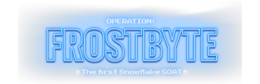
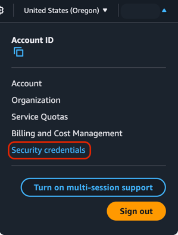
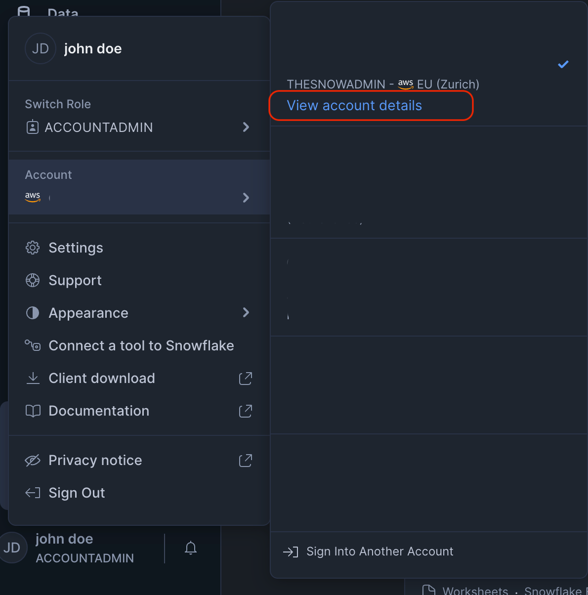
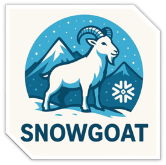

# <p align="center">Operation Frostbyte</p>
<p align="center">

</p>
### <p align="center">AKA SnowGoat</p>

A misconfigured, CTF-like, Snowflake environment.

## Table of Contents

- [Installation](#Installation)
  - [Prerequisites](#Prerequisites)
  - [Configuration](#Configuration)
  - [Provisioning SnowGoat](#provisioning-snowgoat)
- [Usage](#Usage)
  - [Main Objective](#main-objective)
- [References](#references)
- [Support](#support)
  - [Limitations](#known-issues)

## Installation
*This guide applies to all operating systems. If you are using Windows, you should use WSL (Windows Subsystem for Linux). Install WSL(https://aka.ms/wslinstall) by following Microsoft’s instructions:You must also install the AWS CLI and Terraform inside your WSL environment.*

### Prerequisites
An account in each of the following services:
1. **AWS** (Free-Tier: https://aws.amazon.com/free/) - When provisioning Snowgoat, the user must have appropriate permissions to ensure smooth setup and functionality. 
    There are two acceptable ways to grant these permissions:
   1. Attach the AdministratorAccess policy directly to the user or role. This provides full administrative privileges required for provisioning Snowgoat.
   2. Assign the minimum required permissions as the following:
   ```JSON
    {
        "Version": "2012-10-17",
        "Statement": [
            {
                "Effect": "Allow",
                "Action": [
                    "s3:GetObjectTagging",
                    "s3:GetBucketTagging",
                    "s3:GetBucketObjectLockConfiguration",
                    "s3:GetEncryptionConfiguration",
                    "s3:GetReplicationConfiguration",
                    "s3:GetLifecycleConfiguration",
                    "s3:GetBucketLogging",
                    "s3:GetBucketRequestPayment",
                    "s3:GetAccelerateConfiguration",
                    "s3:GetBucketVersioning",
                    "s3:GetBucketWebsite",
                    "s3:GetBucketCORS",
                    "s3:GetBucketAcl",
                    "s3:GetBucketPolicy",
                    "s3:CreateBucket",
                    "s3:DeleteBucket",
                    "s3:ListBucket",
                    "s3:PutObject",
                    "s3:GetObject",
                    "s3:DeleteObject",
                    "s3:PutBucketTagging",
                    "iam:ListInstanceProfilesForRole",
                    "iam:CreateRole",
                    "iam:DeleteRole",
                    "iam:GetRole",
                    "iam:PutRolePolicy",
                    "iam:AttachRolePolicy",
                    "iam:DetachRolePolicy",
                    "iam:CreatePolicy",
                    "iam:DeletePolicy",
                    "iam:GetPolicy",
                    "iam:ListRolePolicies",
                    "iam:ListAttachedRolePolicies",
                    "iam:PassRole",
                    "iam:UpdateAssumeRolePolicy",
                    "iam:GetPolicyVersion",
                    "iam:ListPolicyVersions"
                ],
                "Resource": "*"
            }
        ]
    }
    ```

2. **Snowflake** (30 days free trial: https://signup.snowflake.com/)
   1. Fill in your information
   2. In "Choose your Snowflake edition", select: "Enterprise (Most popular)"
   3. In the Region section, choose a region which is enabled by default at the cloud-provider and does not require any additional region enablement.
   4. After starting your account, you will be prompted to insert the ACCOUNTADMIN user's name and password - these are the credentials that will be used for provisioning resources and data in Snowflake.

> 💡 **Note:** It is recommended to use fresh and personal accounts.

The following software should be installed:
1. **Terraform** (https://developer.hashicorp.com/terraform/install)
2. **awscli** (https://docs.aws.amazon.com/cli/latest/userguide/getting-started-install.html#getting-started-install-instructions)
>💡 **Note:** Windows users should install these via WSL ONLY, using the Linux installations.

After setting up your cloud-services accounts and installed the required software, use environment variables to include your credentials:
### Configuration
#### AWS
**If you are authenticating to a fresh account, use an IAM User:**
1. Log in to [AWS Console](https://eu-central-1.console.aws.amazon.com/console/) using your IAM user with the permissions you added above
2. Click on your username, on the right-upper side of the screen
3. Choose "Security Credentials"



4. Choose "Create Access Keys"
5. Copy these credentials and export/SET them into environment variables for example:
```shell
export AWS_ACCESS_KEY_ID="<access_key_id>"
export AWS_SECRET_ACCESS_KEY="<secret_access_key>"
export AWS_REGION="<aws-region>"
```


**If you are signing-in via SSO, using the AWS access portal:**
1. Log in to AWS via your identity-provider
2. Locate the AWS account that will be used by terraform to provision some of SnowGoat's resources
3. After clicking on the target AWS account, locate the role you will be using
4. Select "Access Keys"
5. Follow the instructions and export/SET credentials to environment variables 

#### Snowflake
**export/SET the following environment variables, using the ACCOUNTADMIN user, created in previous steps:**

Windows users should run WSL before the following steps:
```shell
wsl
```

And continue by exporting the environment variables
```shell
export SNOWFLAKE_ORGANIZATION_NAME="<snowflake_organization_name>"
export SNOWFLAKE_ACCOUNT_NAME="<snowflake_account_name>"
export SNOWFLAKE_USER="<snowflake_user_name>"
export TF_VAR_password="<snowflake_password>"
```
> 💡 **Note:** The `TF_VAR_password` environment variable is a Terraform variable. This is optional, though if not set, Terraform will prompt you for your Snowflake password on each run (apply/destroy).

You can find these details after logging in to your new Snowflake account by:
1. Clicking your name on the left-bottom side of the screen
2. Hover over your account name
3. Click on "View account details"

4. Use the account details to locate the needed values for the environment variables
5. Also, the "Account/Server URL" value will be the one you will use to connect to Snowflake's UI, using your account's context

### Provisioning SnowGoat
After fulfilling all prerequisites and installing dependencies, we can now provision Snowgoat:

```shell
git clone https://github/PLACEHOLDER_FOR_SNOWGOAT_IN_GITHUB
cd snowgoat-infra/
terraform init
terraform apply -auto-approve
```
> 💡 **Note:** Provisioning Snowgoat could take several minutes, depending on Internet connection, you machine's hardware, etc.

If provisioning is successful, terraform will show 0 failed resources provisioned and print the first snowflake user to use in the challenge - `blizzard_engineer`.

## Usage
Find your entry point into Snowgoat!
Start by using the credentials of the Snowflake user `blizzard_engineer`, that were printed by terraform on provisioning, to log in to Snowflake!

### Main objective


The main objective of this educational challenge is to leak data! More specifically, the `SSN` column, of one of the sensitive tables, filled with the **Glacier Corp** customers' Social-Security-Number!

Help **Glacier Corp** to understand how it is possible to leak their sensitive data in Operation Frostbyte!

### Flags
Snowgoat's flags are not consistent in format. Some flags could represent a user name, some could represent sensitive data.
The following are the flag formats in SnowGoat:
- **Flag 1**: User Name
- **Flag 2**: User Name
- **Flag 3**: SSN Value
- **Flag 4**: URL

## References

The following documentation articles and tools should help you solve the challenge:

- [SnowSQL](https://docs.snowflake.com/en/user-guide/snowsql)
- [Snowflake: Network Policies](https://docs.snowflake.com/en/user-guide/network-policies)
- [Snowflake: Authentication Policies](https://docs.snowflake.com/en/user-guide/authentication-policies)
- [Snowflake: Overview of Access Control](https://docs.snowflake.com/en/user-guide/security-access-control-overview)
- [Snowflake: SHOW GRANTS](https://docs.snowflake.com/en/sql-reference/sql/show-grants)
- [Snowflake: Overview of Data Unloading](https://docs.snowflake.com/en/user-guide/data-unload-overview)
- [Snowflake: CREATE STAGE](https://docs.snowflake.com/en/sql-reference/sql/create-stage)
- [Snowflake: CREATE TABLE](https://docs.snowflake.com/en/sql-reference/sql/create-table)
- [Snowflake: ALTER USER](https://docs.snowflake.com/en/sql-reference/sql/alter-user)
- [Snowflake: Understanding Dynamic Data Masking](https://docs.snowflake.com/en/user-guide/security-column-ddm-intro)
- [Snowflkae: Stored Procedures Overview](https://docs.snowflake.com/en/developer-guide/stored-procedure/stored-procedures-overview)

## Support
### Limitations
1. Please avoid changing and adding resources manually, this could cause sync issues with the Terraform state and break the proviosining (apply/destroy)
2. If encountered a sync issue in Terraform, manually delete `*.tfstate`, `*.tfstate.backup`, `*.lock`, `.terraform/` files and folders.
   1. After deleting these files and folders, execute `terraform init` again, to reinitialize providers.
   2. If after destruction, there are still resources left in the services (usually only AWS role/policy), please remove them by hand. This is a rare behaviour.


